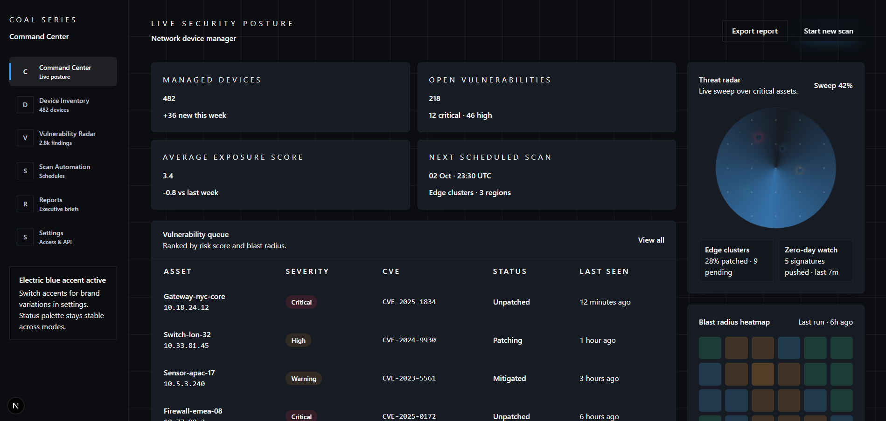

# Coal Series Design System

Coal Series is a cybersecurity-focused design system that pairs a Tailwind CSS preset with a React component kit, documentation site, and interactive showcase. The monorepo is powered by Turborepo and keeps code, tokens, demos, and docs in one place.



## Repository layout

- `apps/docs` — MDX-powered documentation site describing foundations, components, and patterns.
- `apps/showcase` — Interactive product-style dashboard that demonstrates the system in context.
- `packages/tailwind-preset` — Coal-themed Tailwind preset with typography, color tokens, and utility plugins.
- `packages/react-components` — Headless + styled React primitives and domain widgets built with the preset.

## Quick start

Install dependencies:

```bash
npm install
```

Run the documentation site (http://localhost:3000 by default):

```bash
npm run dev -- --filter=apps/docs
```

Run the interactive showcase dashboard:

```bash
npm run dev -- --filter=apps/showcase
```

Build all workspace packages:

```bash
npm run build
```

## Using Coal Series in your app

Apply the Tailwind preset:

```ts
// tailwind.config.ts
import type { Config } from "tailwindcss";
import coalPreset from "@coal-series/tailwind-preset";

const config: Config = {
	presets: [coalPreset],
	content: ["./src/**/*.{ts,tsx,mdx}"],
};

export default config;
```

Compose interfaces with the component kit:

```tsx
import { Button, ExposureScoreCard } from "@coal-series/react";

export function SecuritySummary() {
	return (
		<section className="space-y-6">
			<ExposureScoreCard score={3.1} benchmark={4} change={-0.4} />
			<Button accent="electric">Run remediation</Button>
		</section>
	);
}
```

## Scripts

- `npm run lint` — Lint the entire workspace with the shared ESLint config.
- `npm run typecheck` — Project references type-check for packages and apps.
- `npm run test` — Run component and utility tests (Vitest).
- `npm run dev -- --filter=<target>` — Start an app in dev mode (`apps/docs`, `apps/showcase`).

## Contributing

1. Create a feature branch.
2. Run lint, typecheck, and targeted tests before committing.
3. Open a pull request; CI will verify builds and preview the docs.

See `CONTRIBUTING.md` for the full workflow and coding standards (coming soon).

## License

Coal Series is released under the MIT license. See `LICENSE` for details.
